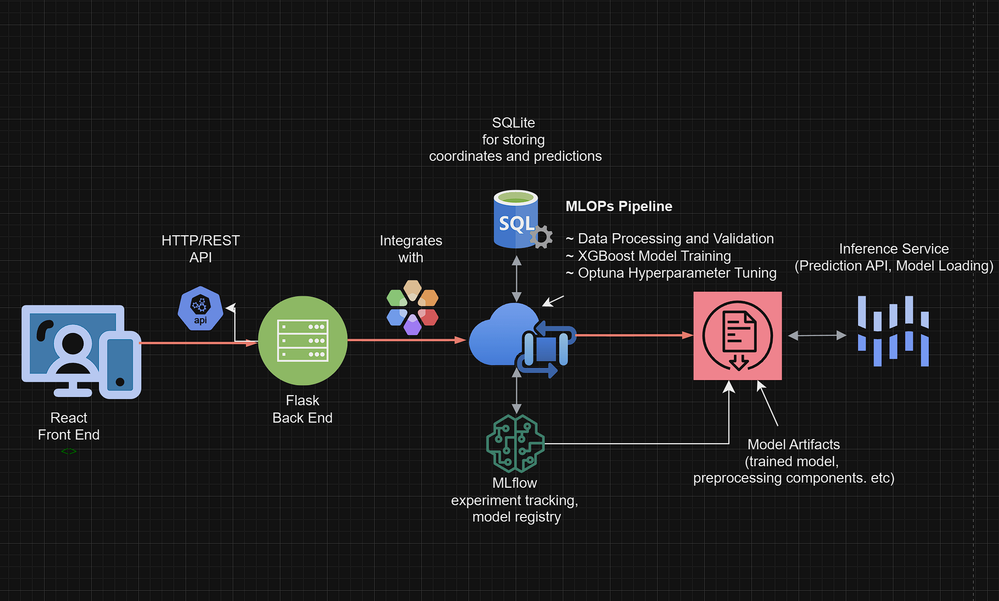

# Manitoba Soil Viability Prediction

An MLOps project for predicting soil agricultural capability in Manitoba using gradient boosting models.

## Project Overview

This project uses machine learning to predict soil viability for farming in Manitoba based on the Manitoba soil dataset. It implements a complete MLOps pipeline for model development, training, evaluation, and deployment.

### Features

- Data preprocessing and feature engineering for soil characteristics
- XGBoost classification model for predicting agricultural capability
- MLflow experiment tracking and model versioning
- Hyperparameter optimization using Optuna and Bayesian methods
- React front end and flask back end (in a different repo)
- Containerized deployment with Docker

### Prerequisites

- Python 3.8+
- pip
- mlflow 23.2.1+
- scikit-learn 
- Optuna
- virtualenv (optional but recommended)

